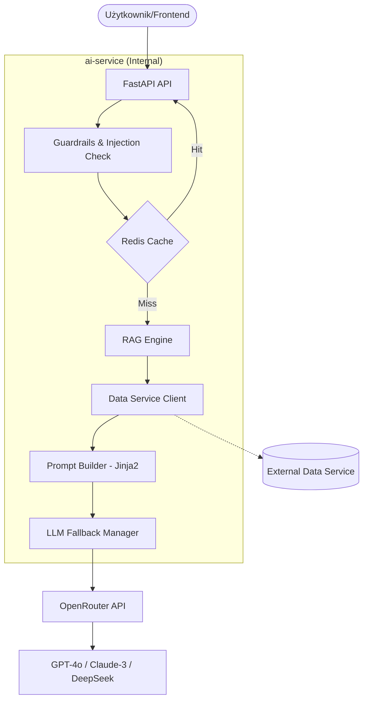
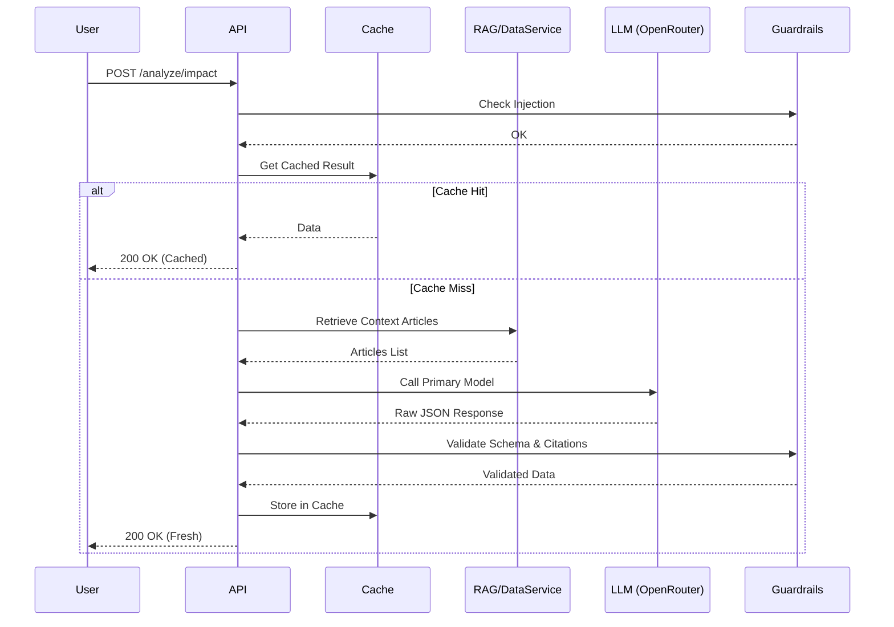

# Dokumentacja Architektury — ai-service

## 1. Wstęp
`ai-service` to krytyczny komponent ekosystemu CivicLens, pełniący rolę inteligentnego silnika analitycznego. Wykorzystuje zaawansowane techniki **RAG (Retrieval-Augmented Generation)** oraz systemy **Multi-Model Fallback**, aby dostarczać precyzyjne analizy prawne przy zachowaniu wysokiej dostępności i bezpieczeństwa.

## 2. Stos Technologiczny (Tech Stack)
*   **Język**: Python 3.12+
*   **Framework API**: FastAPI (Asynchroniczny)
*   **LLM Orchestration**: OpenRouter (Gateway), LangChain (wybrane komponenty)
*   **Pamięć operacyjna/Cache**: Redis (hiredis)
*   **Walidacja danych**: Pydantic v2
*   **Observability**: Structlog (JSON logging), Prometheus (metryki)
*   **Resilience**: Tenacity (retries), HTTPX (async client)

## 3. Diagram Architektury (C4 Level 2 - Context/Container)

## 4. Wzorce Projektowe i Decyzje Architektoniczne

### 4.1. Resilience: Multi-Model Fallback (Pattern: Strategy)
System implementuje łańcuch modeli (Chain of Models). Jeśli model główny (np. GPT-4o) zawiedzie lub przekroczy timeout, system automatycznie próbuje wykonać zadanie modelem zapasowym (np. Claude-3 lub mniejszy model lokalny), co gwarantuje ciągłość usługi.
*   **Lokalizacja**: `app/llm/openrouter.py`, `app/llm/budget.py`

### 4.2. Security: Input & Output Guardrails (Pattern: Chain of Responsibility)
Zastosowano wielowarstwowy system kontroli:
1.  **Pre-processing**: Detekcja Prompt Injection (regex/heurystyka).
2.  **Schema Validation**: Rygorystyczne sprawdzanie typów wyjściowych przez Pydantic.
3.  **Self-Correction**: Jeśli LLM zwróci niepoprawny JSON, system wysyła zapytanie korygujące ("Re-ask").
*   **Lokalizacja**: `app/guardrails/`

### 4.3. Performance: Semantic & Structural Caching
Cache w Redis nie opiera się tylko na zapytaniu, ale na kombinacji: `endpoint + prompt_version + input_hash`. Pozwala to na natychmiastową inwalidację cache po zmianie promptów systemowych.
*   **Lokalizacja**: `app/cache/redis_cache.py`

## 5. Struktura Projektu (Mapping)

| Katalog | Odpowiedzialność | Wzorce |
| :--- | :--- | :--- |
| `app/api/` | Routing i kontrolery wejściowe. | Adapter, DTO |
| `app/llm/` | Klient OpenRouter, logika fallbacku i zarządzanie budżetem tokenów. | Gateway, Strategy |
| `app/rag/` | Logika pobierania kontekstu (retriever) i budowania wiadomości. | Facade, Template |
| `app/guardrails/` | Logika weryfikacji bezpieczeństwa i poprawności danych. | Interceptor, Validator |
| `app/domain/` | Niezależne od technologii modele danych (Pydantic). | Domain Model |
| `app/clients/` | Asynchroniczni klienci do usług zewnętrznych. | Proxy |

## 6. Przepływ Pracy (Sequence Diagram)

## 7. Observability
System jest w pełni monitorowany:
*   **Logi**: Każdy request posiada `X-Request-ID` propagowany do logów strukturalnych, co pozwala na śledzenie pełnego trace'u.
*   **Metryki**: Prometheus eksponuje dane o czasie odpowiedzi LLM, zużyciu tokenów oraz liczbie błędów (HTTP 5xx, LLM Timeout).
